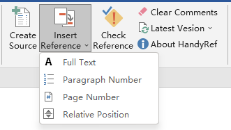
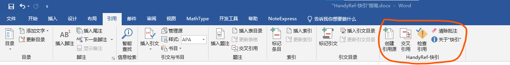
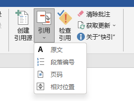

# English Version
## Introduction
&ensp;&ensp;&ensp;&ensp;HandyRef provides a handy way to insert Cross Reference in MS Word, just like copy and paste. "Copy" what you want to reference and "paste" it at the point where cross reference is needed. HandyRef abandons the long list for selecting reference items that MS Word uses and greatly speeds up the cross-reference process. HandyRef can also find broken references in the document and attach comments to them. HandyRef provides Ribbon and keyboard shortcut for the user. Picture below shows the Ribbon that integrated in MS Word "Reference" Ribbon tab. By the way, HandyRef is open-source.

## HandyRef Step by Step

### Insert Cross Reference
&ensp;&ensp;&ensp;&ensp;Only 2 steps are needed to insert a cross reference with HandyRef.
* **Step 1：** Select the contents that needed to be referenced, and click `Create Source` or press `Ctrl+Alt+C`.
* **Step 2：** move the cursor to the point you want to insert a cross reference, and click `Insert Reference` or press`Ctrl+Alt+V`. You can repeat step 2 to insert multiple references that linked to same object.

### Check for Broken Reference
&ensp;&ensp;&ensp;&ensp;HandyRef can find broken references in the document and attach comments to them. Click "Check Reference" to do this.
## Setup of HandyRef
&ensp;&ensp;&ensp;&ensp;Please download the latest template file from the `Release` folder at https://github.com/shishouyuan/HandyRefVBA. Download `HandyRef-English.dotm` if you want an English UI. There are 2 ways to use HandyRef.
### Install HandyRef Globally
&ensp;&ensp;&ensp;&ensp;If you want to use HandyRef all the time, please choose this option. 
&ensp;&ensp;&ensp;&ensp;It takes only one step to install HandyRef。Put `HandyRef-English.dotm` template file into the folder  `%AppData%\Microsoft\Word\STARTUP` in your computer,  restart MS Word and enable macros following the prompt.
### Temporarily Use of HandyRef
&ensp;&ensp;&ensp;&ensp;If you want to use HandyRef for a single file, please load the template file for a existing file or just double click the template file to create a new MS Word file that based on it.

## Claims
&ensp;&ensp;&ensp;&ensp;There is no guarantee given for HandyRef, and users take any consequence on their own. HandyRef is open-source, but can only be used or distributed for non-commercial purpose.

# 中文版
## “HandyRef-快引”简介
&ensp;&ensp;&ensp;&ensp;“HandyRef-快引”为Word提供一个快速添加交叉引用的方式，整个流程类似于复制粘贴：先“复制”要引用的内容，然后在需要交叉引用的地方“粘贴”即可。“HandyRef-快引”改变了Word交叉引用操作需要在冗长的被引对象列表中选取的操作方式，极大提高了工作效率。“HandyRef-快引”还可以查找文档中损坏的交叉引用并添加提示批注。“HandyRef-快引”提个供了工具栏和键盘快捷键两种使用方式，下图展示了集成到Word“引用”选项卡中的“HandyRef-快引”。“HandyRef-快引”是开源的，用户可以浏览其代码以确保没有安全隐患。

## “HandyRef-快引”操作步骤

### 添加交叉引用
&ensp;&ensp;&ensp;&ensp;“HandyRef-快引”添加交叉引用仅需2步。
* **步骤1：** 选中要被引用的内容, 然后点击`创建引用源`或按快捷键`Ctrl+Alt+C`；
* **步骤2：** 将光标置于需要插入交叉引用的地方, 点击`交叉引用`或按快捷键`Ctrl+Alt+V`。此步骤可重复用于连续添加对同一对象的多个引用。
  
### 检查引用错误
&ensp;&ensp;&ensp;&ensp;“HandyRef-快引”可以查找文档中损坏的交叉引用并添加提示批注，方便用户发现文档中存在的交叉引用问题。只需点击`检查引用`按钮即可。
## “HandyRef-快引”的安装
&ensp;&ensp;&ensp;&ensp;首先请从https://github.com/shishouyuan/HandyRefVBA 的`Release`文件夹中获取最新的模板文件, 想使用中文界面请下载`HandyRef-中文.dotm`。有2种安装方式。
### 全局安装“HandyRef-快引”
&ensp;&ensp;&ensp;&ensp;如果希望在编辑任何Word文件时都可以使用“HandyRef-快引”, 请选择全局安装。
&ensp;&ensp;&ensp;&ensp;安装方法仅需1步。将`HandyRef-中文.dotm`模板文件放入电脑中的`%AppData%\Microsoft\Word\STARTUP`文件夹, 重新打开Word根据提示启用宏即可。
### 单次使用“HandyRef-快引”
&ensp;&ensp;&ensp;&ensp;若仅希望针对单个文件使用“HandyRef-快引”, 对已有文件可以直接加载`HandyRef-中文.dotm`模板文件（操作方法请上网搜索）, 对新文件可以直接双击`HandyRef-中文.dotm`模板文件来创建新文件。
## 声明
&ensp;&ensp;&ensp;&ensp;“HandyRef-快引”出于作者兴趣开发, 作者不对其表现进行任何承诺, 用户自己承担由于使用“HandyRef-快引”所造成的后果。“HandyRef-快引”是开源的, 用户仅可基于非商业目的对其进行使用和再分发。
